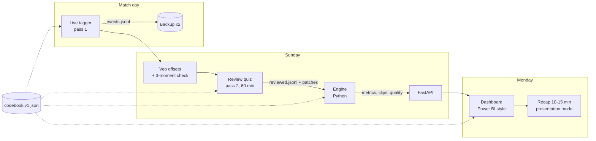

# Lauréats match analysis — complete pipeline (v1)

> This document describes **the whole system, from the key pressed at the match to the Monday recap**, in enough detail to rebuild it from scratch.
> Every definition, key, review question and formula lives in [`CODEBOOK.md`](CODEBOOK.md). This file says *who does what, when, with which tool, what comes out, how it is checked, and what to do when it breaks*.
>
> Date: 2026-10-02. Supersedes `docs/superpowers/specs/2026-09-30-two-pass-tagger-design.md` and its plan.
> Decided over four councils, then adjusted to the analyst's real role (§1.2).

---

## Contents

1. Purpose, role, principles
2. System overview
3. Data and files
4. Tool 1 — the live tagger (pass 1)
5. Tool 2 — the review quiz (pass 2)
6. Tool 3 — the engine
7. Tool 4 — the dashboard
8. The weekly routine (SOP)
9. The Monday recap
10. Season setup and season close
11. Failures and recovery
12. Build plan
13. Extras: when the role grows
14. Decision log
15. Glossary

---

## 1. Purpose, role, principles

### 1.1 Purpose

Show **what happened, with proof**, and track **whether the team is improving on last year**, in the staff's own terms:

| Staff priority | Measured in |
|---|---|
| Score many goals, create the most chances, don't concede | CODEBOOK §8.1 |
| Strength in transition, build-up and set pieces | §8.2 |
| xG, xT | §7, §8.3 |
| Half-space usage: finding players there | §8.4 |
| Reaching the red zone, attacking the 18 | §8.5 |
| Grit and intensity | §8.6 |
| **Improvement on last year** (the top priority) | §9 |

### 1.2 The analyst's role (it shapes everything below)

- The analyst is an **apprentice / intern**, a welcome addition to the staff. They are not a decision-maker.
- The work is **on trial**. It becomes part of the routine once the staff rely on it. The system has to earn that by being **reliable, short and useful**, not by asking for time.
- The head coach is very busy:
  - **Nothing is sent unless it matters.**
  - **Nothing in the routine depends on the coach doing something.**
- The Monday slot is a **10–15 min recap**. Longer presentations come later, when sessions allow.
- **Other analysts use the dashboard too.** It must be a real analysis tool (Power BI / Tableau style), not a page of numbers.
- Training decisions, objectives and player-facing content are **extras** (§13). They are fully specified, but switched on only if the role grows.

### 1.3 Principles

1. **Proof = a clip.** Every number on screen opens the moments it is made of. If a number can't do that, it isn't shown.
2. **Facts live, judgement on video, counting by computer.** Live: who has the ball, where, restarts, shots. Video: how and why, on moments the live log selected. Engine: every count, rate and model.
3. **The live log is never edited.** Corrections and answers are added as new lines. Everything else can be recomputed from the log at any time.
4. **One codebook, versioned.** It is stamped in every match. A definition change is a new version, never a silent edit.
5. **Layers, not rebuilds.** New complexity is a new card, a new metric or a new view on the same log (§13).
6. **Honest about small samples.** About 15 matches a season: every number carries its n and its review coverage, and shows "trop tôt" (too early) when there isn't enough.
7. **Definitions belong to the staff.** The codebook v1 definitions were confirmed on 2026-10-02; any change follows the codebook's versioning rules.

---

## 2. System overview



| Component | Technology | Location | State |
|---|---|---|---|
| Codebook | JSON + this markdown | `shared/codebook.v1.json`, `docs/pipeline/CODEBOOK.md` | to build (JSON) |
| Live tagger + review quiz | Vite 5 + React 18 + Tailwind 3, built into **one offline HTML file** (`vite-plugin-singlefile`); storage in IndexedDB (`idb`) | `tagger/` | to build |
| Engine | Python 3.14, pure functions, pytest | `src/` (`ingestion/`, `analytics/`, `validation/`) | partly exists |
| API | FastAPI | `src/api/app.py` | exists, to extend |
| Dashboard | Vite + React + Tailwind + Recharts | `dashboard/` | exists, to restructure |
| Tools | Python scripts | `tools/` (xG table, xT grid, backup, match sheet) | to build |

**Existing engine modules reused:**

| Module | Role |
|---|---|
| `possessions.py` | possession reconstruction for old exports |
| `metrics.py` | — |
| `classic.py` | old staff formulas: field tilt, transition speed, set-piece shots |
| `phases.py` | splits, counter-press, regain curve, flow, durations |
| `timeline.py` | match story |
| `season.py` | season profile |
| `clips.py` | clip selection |
| `video.py` | Veo links with per-half offsets |
| `quality.py` | tagging checks |
| `report.py` | — |

---

## 3. Data and files

### 3.1 Folder per match

```
matches/2026-10-04_Vanier/
  meta.json          # match sheet (editable, every edit logged in meta.history)
  events.jsonl       # live log — append-only (CODEBOOK §4)
  reviewed.jsonl     # review answers — append-only (CODEBOOK §5)
  outputs/
    metrics.json     # all metrics {value, n, coverage, label, clips}
    clips.json       # every clip list
    quality.json     # gates, coverage, reliability, presses/min
    run.json         # engine git hash, codebook version + sha256, timestamp, diff vs last accepted run
  sha256.txt         # checksums of the three input files
```

The location is `FA_MATCH_DIR` (default `../laureats-tagger/matches/`). Old exports (v0.x JSON) stay in `../laureats-tagger/exports/` and are read by the old path.

### 3.2 `meta.json`

```json
{
  "id": "m_2026-10-04_vanier",
  "date": "2026-10-04", "kickoff_local": "19:00",
  "opponent": "Vanier", "venue": "away",
  "opponent_tier": "top|mid|bottom",
  "codebook_version": "1.0.0", "codebook_sha256": "…",
  "tagger_version": "two-pass@1.0.0",
  "veo": {"url": "https://app.veo.co/matches/…", "offset_h1_ms": 779000, "offset_h2_ms": 4213000, "checked": true},
  "flip_from_h2": true,
  "conditions": {"weather": "rain", "pitch": "turf"},
  "final_score": {"us": 2, "them": 1},
  "notes": "",
  "history": [{"at": "…", "field": "veo.offset_h2_ms", "from": null, "to": 4213000}]
}
```

### 3.3 Naming and export

- **File names:** `laureats_<YYYY-MM-DD>_<Opponent>_v1.json` for a single-file export (meta + events + reviewed bundled). The match folder is the working form.
- **Export** bundles the three files into one JSON (`{"meta":…, "events":[…], "reviewed":[…]}`). **Import** accepts that bundle and old v0.x exports.
- **Export happens:** automatically at half time and at the end of the match, and on demand with `Ctrl/Cmd+S`.

### 3.4 Backups

- After every export, `tools/backup.py` copies the bundle to **two places**: the home server and a cloud folder.
- It writes `sha256.txt` and checks that the copies are identical.
- **Once a month:** restore one random match from the backup and check that the report hash is identical.

---

## 4. Tool 1 — the live tagger (pass 1)

### 4.1 Screens

1. **Lancement ("Reprendre ou nouveau ?")**
   - The last session (opponent, date, number of presses).
   - Buttons: **Reprendre** (resume), **Nouveau match**, **Importer un match**, **Importer pour la revue (passe 2)** (imports a tagged match and opens the quiz directly).
   - Importing a match that is already stored never replaces it silently: a dialog offers **Fusionner** (keep each half from the version picked for it, by default the one with more presses; the other file's lines are renumbered with their links), **Remplacer** (after confirmation) or **Importer comme copie**.
   - Old-tagger (v0) exports can't be reviewed: the quiz needs a match tagged with the v1 tagger.
   - The list of stored matches, each with Reprendre / Exporter / Revoir (opens the quiz).
2. **Feuille de match (setup)**
   - Fields: opponent, date, venue, opponent tier, Veo URL, kick-off offset MT1 (mm:ss), kick-off offset MT2 (mm:ss), and the "inverser les zones en MT2" option.
   - Every field can be filled in later. The offsets usually come after Veo has uploaded.
3. **Live**, top to bottom:
   - **Header:** score LAU – OPP, clock (big), MT1/MT2, state Running/Paused, buttons −1m −10s +10s +1m, the "Sauvegardé ✓ / ✗" badge, the Inverser toggle.
   - **State banner** (full width, the largest element): *Notre ballon* (gold #b8862e) / *Leur ballon* (blue #2a6aa8) / *Ballon mort* (grey). It also shows the pending restart.
   - **Pitch view** (horizontal, our goal on the left; mirrored when Inverser is on): the six bands drawn on a pitch, current band highlighted, **clickable**. After a throw-in or free-kick key it pulses and asks for the band of the restart.
   - **Journal**: every press, newest (by match time) first, scrollable. Cancelled lines are struck through, corrected ones marked « modifié ». Clicking a line opens an editor: change the value (state, band, restart, shot), change the time (±1 s / ±5 s or mm:ss), Supprimer, or Restaurer. Edits are appended to the log, never written over it (CODEBOOK §4).
   - **Load:** presses/min over the last 5 min and since kick-off. Amber above 12, red above 14.
   - **Heartbeat:** seconds since the last state or band press. It flashes after 90 s.
   - **"Fil perdu" indicator** while a `LOST` window is open.
   - Buttons **Mi-temps (M)** and **Fin du match**.
4. **Aide (`?`)**: every key, with its codebook definition.

### 4.2 Keys

The full table is in CODEBOOK §3. In short:
- **Match keys:** `Q W E` · `0–5` · `A S D F Shift+D` · `Z X C` · `R` (flag) · `T` (lost thread).
- **Comfort keys:** `Space` · `[ ] { }` · `M` · `+ - * _` · `Backspace` / `Ctrl+Z` · `Ctrl+S` · `?` · `Esc`.

Keys are read by **physical position** (`event.code`), so the layout works on any keyboard (QWERTY, Canadian French). Keys are ignored while a text field has focus.

### 4.3 Behaviour rules

- **Clock:** Space starts or pauses it. Nudges work whether it's running or paused, and never go below the start of the current half (0 or 45:00). `M` pauses, switches to MT2, sets the clock to 45:00 and offers to turn on Inverser; the next Space starts MT2.
- **Goal (`C`):**
  - adds 1 to the scoring team's score;
  - inserts an automatic DEAD;
  - sets the pending restart to KICKOFF for the other team.
- **Restart key:** only accepted while the state is DEAD (otherwise it shows a toast and is ignored). Corner, goal kick, penalty and kick-off: the next `Q`/`W` takes it and applies the automatic band. Throw-in and free kick (offside included): the tagger asks for the band of the restart; taking it without a band shows a warning.
- **Shot team:** decided by the zone: bands 3–5 → us, bands 0–2 → them, whatever was pressed first. A penalty pressed while the ball is dead goes to the team that had the ball. A message appears when the zone overrides the possession.
- **Undo:** adds `U` for the last match press that hasn't been cancelled. It can be repeated.
- **Inverser:** usable in either half, whenever we attack right-to-left on the footage: a band press `n` is stored as `5 − n` (a click on the pitch is already absolute). Offered at `M`. The banner shows "Zones inversées".
- **Recommencer:** for a false start. Cancels every press and score correction and resets the clock to 0, written to the log.

### 4.4 Saving

- Every press is written to IndexedDB **before** the screen updates.
- A snapshot of the whole match is taken every 5 min, and the last 3 are kept.
- **If storage fails** (private window, full disk): the presses stay in memory, the badge turns red "Non sauvegardé", and the tagger prompts for an export every 5 min.
- **Reloading the page** (or a browser crash) reopens the match exactly where it was, clock included. A running clock is reconstructed from the last known value plus the wall-clock time since then, and a toast says so.

### 4.5 Offline build

- The source is in `tagger/src/`:
  - `core/` holds pure logic with `node --test` tests;
  - `live/`, `review/` and `setup/` hold the screens;
  - `store/` holds IndexedDB.
- `npm run build` produces `tagger/dist/index.html`, one self-contained file that works by double-click with no network.
- This file is copied to the laptop used at matches. Each release is tagged `tagger-vX.Y.Z`.

---

## 5. Tool 2 — the review quiz (pass 2)

### 5.1 What it is

After the match, the quiz screen (inside the same HTML file) reads the live log and **generates one card per moment matching a trigger** (CODEBOOK §5): shots, goals, gaps, flags, entries, losses in their half, set pieces, duels and opponent entries. The analyst never rewatches the full match.

### 5.2 Layout (two windows side by side)

```
┌────────────── QUIZ ──────────────┐  ┌──────── VEO (one reused tab) ────────┐
│ ENTRÉE 7/31 · MT2 63:12 · LAU     │  │                                       │
│ [▶ Ouvrir dans Veo]  (-5 s)       │  │        match video at 63:07           │
│ Couloir ? 1 G  2 Int.G  3 Axe     │  │                                       │
│           4 Int.D  5 D   0 ?      │  │                                       │
│ Méthode ? 1 passe 2 conduite …    │  │                                       │
│ Entre les lignes ? 1 oui 2 non    │  │                                       │
│ Issue 15 s ? 1 tir 2 surface …    │  │                                       │
│ Définition : couloir intérieur =  │  │                                       │
│ entre la ligne des 18 m et celle  │  │                                       │
│ des 6 m, prolongées.              │  │                                       │
│ ⏱ 34:12 / 60:00  · Tier 2 · 81 %  │  │                                       │
└───────────────────────────────────┘  └───────────────────────────────────────┘
```

- **The Veo link opens in a named window** (`window.open(url, "veo")`), so the same tab is reused every time.
- **Keys:**
  - `1–9` answer the current question and move to the next one; `0` = can't see.
  - `Enter` = next card; `←` = previous; `K` = skip.
  - `V` = move this moment (§5.6); `O` = reopen Veo.
- **The card shows** its codebook definition, its tier, the timer and the coverage so far.

### 5.3 Order and time budget

| Tier | Time | Cards |
|---|---|---|
| 1 — mandatory | first 30 min | SHOT, GOAL, GAP, FLAG |
| 2 — every week | next 20 min | ENTRY, then LOSS |
| 3 — rotating theme | last 10 min | SET_PIECE → DUEL → OPP_ENTRY (one theme per week, in rotation) |

- Within a tier, cards are in chronological order.
- **60:00 is a target, not a stop.** Past it the timer turns red (« temps dépassé ») and answering continues; cards never answered stay `UNREVIEWED` and count in the coverage. The time spent is kept for the time log (W7).
- **If Tier 1 isn't finished at 30 min,** it continues, and Tiers 2–3 shrink.

### 5.4 Pre-filled answers

- The LOSS card's `regain_5s` is computed from the log; the analyst only confirms it.
- The GOAL card's `phase_check` shows the computed phase.

### 5.5 Answers

- Each answer is appended to `reviewed.jsonl` (CODEBOOK §5).
- Changing an answer appends a new line; the latest one wins.
- The quiz can be closed and resumed at any time.

### 5.6 "Move this moment" (`V`)

Use it when a clip clearly misses the moment, because the live press was too late or too early:

1. The analyst types the right Veo time (mm:ss) shown in Veo.
2. The quiz converts it back to the live clock and appends a `PATCH` with the corrected time.

The original press stays in the log. The patch is also used to measure the typical tagging lag (§6, stage 8).

### 5.7 GAP cards

A GAP card shows its window. The analyst adds the states (our ball / their ball / dead) and bands seen on the video at their Veo time; **Valider le remplissage** retracts the `LOST` press and appends those lines (`gap_fill: true`), **Laisser inconnu** keeps the window untrusted. Nothing is overwritten.

### 5.8 Where it lives

`tagger/src/core/cards.js` (card generation, same counts as the engine's labels; pinned on the Ahuntsic fixture), `core/review.js` (answers, coverage), `core/video.js` (Veo links, 5 s lead, and the reverse for « déplacer le moment »), `review/ReviewScreen.jsx` (the screen). Opened from the launch screen (« Revue ») or the live screen (« Revue (passe 2) »). The engine joins answers by original press (`src/v1/answers.py`).

---

## 6. Tool 3 — the engine

**One command** (`python -m src.run <match_dir>`) does everything. The API also runs it automatically when a match folder changes. Every stage is a pure function with tests.

| Stage | Input → output | Rule (see CODEBOOK) |
|---|---|---|
| 1. **Validate** | files → OK / blocked | gate G1: schema, version, SHA-256 |
| 2. **Order** | ops → effective ops | resolve retractions, apply patches, sort (§4) |
| 3. **Timeline** | ops → state segments + band segments | §6.1 |
| 4. **Label** | timeline → possessions, regains, losses, phases, entries, chances | §6.2–6.5 |
| 5. **Join** | answers → linked to their press (`seq`) or nearest band change ±5 s | §6.7 |
| 6. **Models** | shots → xG; band moves → xT | §7 |
| 7. **Metrics** | everything → catalogue values | §8. Each returns `{value, n, coverage, label, clips}`. Clips: "3 typical + 3 extreme" (typical = closest to the median of the metric's moments; extreme = highest-xG or largest-gain moments) |
| 8. **Calibration** | `V` patches → median tagging lag per op kind | Informs the clip lead (stays 5 s unless the median lag exceeds 4 s, which triggers a codebook PATCH proposal) |
| 9. **Checks** | everything → gates G2–G5, coverage, reliability, presses/min | §10, §11. Blocking gates stop the report |
| 10. **Season** | metrics → `season_table` row, 5-match rolling means, status per metric | §9.4 |
| 11. **Output** | → `metrics.json`, `clips.json`, `quality.json`, `run.json` | `run.json` stores the engine git hash, codebook version + SHA-256, and the diff against the last accepted run |

- **Old exports** (v0.x) go through the existing path (`possessions_from_match` etc.) and are shown labelled "v0".
- **New entry point:** `normalize_match(raw) -> (match, possessions)` routes by `schema_version`.
- **Tests:**
  - one test per definition and formula, pinned on small synthetic logs;
  - one **golden match** (a real re-tagged match) whose full output is snapshotted;
  - the existing suite stays green.

**Where it lives (built in P2–P4):** `src/v1/log.py` (stage 2), `timeline.py` (3), `labels.py` (4), `answers.py` (5), `models.py` (6: xG per shot, xT gains), `metrics.py` (7: the catalogue, clips 3 typical + 3 extreme, min n, coverage), `quality.py` (8: calibration, reliability agreement and coarsening), `gates.py` (9), `season.py` + `improvement.py` (10), `adapter.py` + `src/ingestion/normalize.py` (presentation to the existing engine). Tables are built by `tools/build_xg_table.py` and `tools/build_xt_grid.py`.

**API additions:**

| Endpoint | Returns |
|---|---|
| `GET /matches/{id}/metrics` | catalogue values |
| `GET /matches/{id}/clips?metric=` | clip list for a metric |
| `GET /matches/{id}/quality` | gates, coverage, reliability, load |
| `GET /season?compare=2025` | season table with statuses |
| `GET /matches/{id}/recap` | data for the Récap page |

The API contains no football logic.

---

## 7. Tool 4 — the dashboard

### 7.1 Style: Power BI / Tableau, built for several analysts

- **Filter bar** (sticky, top of every page; it filters every visual on the page):
  - **Saison** (2025 / 2026);
  - **Match** (one or several; default = last match);
  - **Adversaire** (tier: haut / milieu / bas);
  - **Lieu** (domicile / extérieur);
  - **Mi-temps** (MT1 / MT2 / tout);
  - **Phase** (transition / construction / attaque placée / CPA / tout);
  - **Comparer à** (moyenne saison / 2025).
- **KPI card row** under the filters on every page, 4–6 cards. Each card shows the value, the comparison delta (▲▼ against the chosen reference), a sparkline over the season, the status chip, and n · coverage %.
- **Visual grid:** a 12-column grid of tiles. Every tile has:
  - a **title written as the question it answers** (e.g. « Où entrons-nous dans la zone rouge ? »);
  - a subtitle with n, coverage and label ("trop tôt", "partiel", "xG table publique");
  - a `⋯` menu: **Voir les clips**, **Exporter CSV**, **Exporter PNG**, **Définition**.
- **Cross-filtering:** clicking a bar, cell or point filters the other tiles on the page, Power BI style. Clicking again clears it.
- **Drill-through:** a double-click, or **Voir les clips**, opens the **clip drawer** on the right: "3 typiques · 3 extrêmes", then the full list. Each clip has its time, a caption of what to watch, its Veo link (−5 s) and an "Épingler au récap" pin.
- **Plain French on screen:** xT → « progression dangereuse », half-space → « couloir intérieur », SD hidden. The `?` next to each term gives one sentence and one example clip.
- **Visual language:**
  - DESIGN.md tokens: gold #b8862e for us, blue #2a6aa8 for them, grey #e8e6e1 neutral; sequential and diverging ramps already validated.
  - One accent per visual. No 3D, no gradients.
  - Dense, but with breathing room between tiles.

### 7.2 Pages

| # | Page | Who it's for | Content (top to bottom) |
|---|---|---|---|
| 1 | **Récap** | Monday recap, quick look | **KPI cards:** score, xG for/against, chances for/against, possession %, territory. **6 status chips** (Identité, Phases, Couloir intérieur, Zone rouge, Intensité, Défense) with AMÉLIORÉ / STABLE / EN BAISSE / TROP TÔT. **Match story** (threat line + possession band, goal markers). **Pinned clips** (3–4) with captions. **« À surveiller »**: one sentence written by the analyst. Button **Mode présentation** |
| 2 | **Saison** | Everyone; improvement on 2025 | **Small multiples:** one per priority, showing the 5-match rolling line, the 2025 band (mean ± 0.5 SD), per-match points and the status chip. **Metrics table:** every catalogue metric with value, 2025 baseline, delta, status, n, coverage; sortable. **Split by opponent tier** and home/away. **Footnote:** mapping bias and re-tag baseline |
| 3 | **Attaque** | Analysts | xG per phase (bars, xG/10 min) · funnel red zone → box → shot → goal · shots table (sortable) · xT by lane and phase (stacked bars) · transition beeswarm (regain → box time) · conversion with its interval |
| 4 | **Couloirs & zone rouge** | Analysts | Lane × band heat grid (entries, gold ramp) · half-space metrics (entry share, between the lines, HS → box, HS assists) · attempt success rates (half-space, box, progression) · red-zone and box entries per 10 min · entry methods (100 % bars) |
| 5 | **Possession & construction** | Analysts | Possession timeline strip · possession flow (Sankey: start → outcome) · build-up → band 4 · territory (time) vs classic field tilt · possession durations (density) · game-state possession |
| 6 | **Intensité** | Analysts | Counter-press 5 s and the regain curve (survival curve 0–60 s) · high regains on a 6-band pitch · players closing within 3 s (distribution) · duels · resilience (late game, after conceding) · opponent possession length |
| 7 | **Coups de pied arrêtés** | Analysts | Set-piece butterfly (ours / theirs) · delivery zones · first contact won · shots within 20 s · xG per set piece |
| 8 | **Défense** | Analysts | xG against by phase · opponent entries into our box by lane · shots against by location · losses that led to shots against |
| 9 | **Clips** | Everyone | Clip library with all filters (metric, phase, lane, band, outcome, team, half) and cross-filtering from the filter bar |
| 10 | **Données** | Analysts | Integrity gates · coverage per question · reliability (latest blind check) · presses/min per 15-min block · tagging and review time · usage log (which pages and tiles are opened) |

**Where the existing dashboard goes:**
- Its charts are kept and placed on these pages: match story → Récap; radar → Saison; bullets → KPI cards; band and lane pitch maps → Couloirs; Sankey, timeline and durations → Possession; regain curve → Intensité; butterfly → Coups de pied arrêtés; funnel and beeswarm → Attaque.
- The old tabs (Aperçu / Possession / Attaque / Terrain / Clips) disappear as tabs, but none of their content is lost.

### 7.2b State of the build (P6, first pass)

Built: the v1 pages above (Récap, Saison, Attaque, Couloirs & zone rouge, Possession & construction, Intensité, CPA, Défense, Clips, Données) for matches tagged with the v1 tagger, fed by `GET /matches/{id}/metrics` and `GET /season/v1`; KPI row per page from catalogue metrics; tiles titled with their question, n / coverage / status as the note, `⋯` menu (clips, definition, CSV); clip drawer (typical + extreme when moments carry a weight, a spread sample otherwise). Old-tagger matches keep the previous tabs.

Filters (P6, done): **Mi-temps** (Tout / MT1 / MT2) recomputes every metric on that half (`GET /matches/{id}/metrics?half=`; the classic field tilt, a whole-match formula, is not shown per half); **Adversaire** (haut / milieu / bas) and **Lieu** (domicile / extérieur) filter the season view and the reference statuses (`GET /season/v1?tier=&venue=`). **Click a bar → its clips**: xG by phase (ours and theirs), xT by lane and by phase open the drawer on the moments of that bar. **Phase is a breakdown, not a global filter**: filtering every metric by phase would mix definitions (possession minutes, entries, losses) — the phase splits live in the tiles that need them. Phone (390 px): tabs scroll, KPIs two per row, tiles in one column, the drawer full width; the filter bar is sticky only from tablet width up. Esc closes the drawer.

Dashboard v2 (2026-10-07): storytelling first. Built from the council on data storytelling (Flourish's five skills, one message per visual, plain sentences, 10-second test) and only from the v1 engine.

- **Every staff tile is titled with a finding** written from the data ("14 de nos 26 entrées passent par la gauche"); the question it answers is the grey line underneath. Sentences come from `GET /matches/{id}/texts`: templates always, rewritten by Claude (`claude-opus-5-5`, one structured call) when `ANTHROPIC_API_KEY` is set on the API; a sentence is kept only if every number in it comes from the engine's facts. The analyst rewrites any sentence in place (pencil on hover, `PUT /matches/{id}/texts/{key}`); edits win; texts are cached in `data/texts/` (git-ignored) and regenerated when the numbers change.
- **Our own pitch drawings** on the tagger's grid (6 bands x 5 lanes): entries by lane and depth, losses by zone, shot zones (count, xG, goals), set-piece deliveries. Open-source pitch kits assume x/y events; our data is zonal.

| Tab | Visuals |
|---|---|
| Récap | the headline (editable) · KPIs · the match in xG with scorers' names · the match in 15-minute blocks (xG each side, possession, our entries) · our priorities · what worked / what cost us (sentence + us vs them) · the week's focus · « Récap » slides using the same sentences |
| Attaque | our shot zones on the pitch · how our shots are created vs theirs · red zone → box → shot → goal · xG per phase |
| Zone rouge & couloirs | entries on the pitch by lane and depth · what happens after an entry (100 % bar) · entry methods · half-space and box metrics |
| Pressing & transitions | players closing within 3 s · losses on the pitch by zone with their causes · what we were trying · our losses followed by their shot |
| CPA | our set pieces by type and zone with shots within 20 s · delivery map · theirs · set-piece metrics |
| Défense | their shot zones · how their shots are created · their xG per phase · their entries into our box (when reviewed) |
| Joueurs | « Création vs prise de risque » scatter · duos passer → shooter · one card per player (creation xG + xA, entries and how many led to danger, losses, first presses and reaction to own loss) · full sortable table; minutes played from the lineup in the tagger's match sheet |
| Saison | our priorities match after match (trend and status once there are enough matches) |

**Analyst page** (`#analyste`, no tab): what was not measured, gates, coverage, tagging load, shots table, xT, possessions, full catalogue, CSV export. Player names are shown (agreed with the coach). Veo links stay off (`dashboard/src/veo.js`) until the second-half offsets are checked.

**Staff export (read-only link).** The whole dashboard of one match frozen in one HTML page, published as a private claude.ai link that the analyst shares with the staff only (named player stats: never a public site):

```bash
cd dashboard && npm run build:snapshot        # after any dashboard change
.venv/bin/python -m tools.export_snapshot <match_id>   # -> data/exports/<match_id>_staff.html
```

Then publish the file (a new link per match, or republish to keep the same one). The export embeds every answer the staff pages need (both halves, every season filter); editing, the analyst page and CSV export are off.

### 7.3 Presentation mode (from Récap)

- **16:9 full screen**, text 24 px or larger, arrow keys to move, a discreet 15-min timer, `Esc` to leave.
- **Generated slides:**
  1. **Le match en bref:** score, 3 KPIs and their chips.
  2. **Ce qui a bien marché:** 1 number + 2 clips (inline).
  3. **À travailler / à surveiller:** 1 number + 1–2 clips.
  4. **La tendance:** one small multiple from Saison.
  5. **À surveiller:** the analyst's sentence.
- The analyst picks the numbers and clips by pinning them. By default the engine proposes the largest deviations against the season mean, ranked by staff priority.

### 7.4 Phone

- One column: Récap (KPIs, chips, pinned clips) → Saison chips → Clips.
- The filter bar collapses into a single "Filtres" button.
- Analyst pages are laptop-only.

---

## 8. The weekly routine (SOP)

Example with a Saturday match; shift the days for other match days. Each step lists its input → action → output · tool · check → what to do if it fails.

| # | When / time | Step |
|---|---|---|
| W1 | Thursday, 10 min | **Match sheet.** Fixture + Veo link → create `meta.json` (`tools/new_match.py` or tagger setup) with opponent, date, venue, tier, codebook version. **Check:** the codebook version is the frozen one. **Fail:** use the last frozen version and note it |
| W2 | Friday, 10 min | **Dry run.** Tag 3–5 min of last match's Veo on the release build → export → engine → open 2 clips. **Check:** the engine runs and the clips land correctly. **Fail:** roll back to the previous `tagger-v*` tag; if that fails too, the old tagger is the fallback for this match |
| W3 | Match, 90+ min | **Live tagging** (§4). Half time: the automatic export plus a USB copy, and confirm "Exporté". **Check:** banner visible; the score from `C` presses = the scoreboard. **Fail:** `T` (lost thread) and resume at the next dead ball. Laptop dies: paper sheet (§11) |
| W4 | Final whistle +10 min | **Export + backup** (`tools/backup.py`). **Check:** checksums match; number of presses plausible (≈ 500–1 000). **Fail:** restore the half-time export; mark the second half "partiel" for the GAP cards |
| W5 | Once Veo has uploaded, 5 min | **Veo offsets + check.** Enter the MT1 and MT2 offsets, then open 3 random moments per half. **Check:** each one lands within 5 s (gate G3). **Fail:** re-sync from a goal or the half-time whistle; Veo late → W6–W9 move one day |
| W6 | Sunday, ~60 min | **Review quiz** (§5). **Check:** 100 % of Tier 1 done. Past 60 min the timer turns red; carry on or stop, the rest stays `UNREVIEWED` |
| W7 | Sunday, 2 min | **Engine** (automatic). **Check:** no blocking gate. **Fail:** fix with a patch and re-run; if still blocked on Monday morning, the recap is clips only |
| W8 | Sunday, 10 min | **Quality.** Données page: coverage, load. Every 3rd match: blind re-check of 20 cards (CODEBOOK §10, about 10 min, done ≥ 7 days later, so on the following Sunday). **Fail:** labels apply automatically |
| W9 | Sunday or Monday morning, 30 min | **Prepare the recap:** pin 3 numbers and 3–4 clips, write the « À surveiller » sentence, run through presentation mode once |
| W10 | Monday, 10–15 min | **Recap** (§9) |
| W11 | Monday, 2 min | **Message, only if it matters** (§9.3) |
| W12 | Monthly, 15 min | **Restore test** from backup |

**Analyst time per week:** about 90 min live + 60 min quiz + 30 min prep + about 20 min of checks ≈ **3 h 20**, of which the match itself is 90 min.

---

## 9. The Monday recap

### 9.1 Agenda (10–15 min, presentation mode)

| Min | Slide | What is said |
|---|---|---|
| 0–1 | Le match en bref | Score, xG for/against, chances. One sentence of context (opponent tier, venue) |
| 1–5 | Ce qui a bien marché | 1 number, 2 clips. Let the staff comment |
| 5–9 | À travailler / à surveiller | 1 number, 1–2 clips. Phrased as an observation, not a prescription: « on voit que… » |
| 9–12 | La tendance | One trend against 2025 (the priority that moved most), with its status |
| 12–15 | À surveiller | One sentence for the coming weeks; questions |

**Caps: at most 3 numbers and 4 clips.** Anything else stays in the dashboard for anyone who wants to dig.

### 9.1b How "best" and "worst" are chosen (built in P7: `src/v1/recap.py`, `GET /matches/{id}/recap`)

- **First matches (fewer than 3 other v1 matches): compared with the opponent.** Each pair ours / theirs (shots, xG, chances, transition → box, build-up → zone 4, set piece → shot, first contact) is scored by the relative gap (us − them) / max(us, them). Best = the 2 largest positive gaps, worst = the 2 largest negative ones.
- **From the 4th v1 match: compared with our season.** Each metric (status ok or partiel) is scored by z = (value − mean of the other matches) / their standard deviation, in its good direction. Best = the 2 highest z (≥ 0.5), worst = the 2 lowest (≤ −0.5). Outcomes (goals) are not levers and are left out.
- **The trend slide** shows a metric whose improvement status is AMÉLIORÉ or EN BAISSE (with last season once the baseline exists); until then it says the trend is not available yet.
- Each item carries up to 3 clips; the « À surveiller » sentence is typed on the last slide (kept in the browser).
- Presentation mode: button on Récap, 5 slides, ← → to move, Esc to leave, 10-minute countdown in the corner.

### 9.2 Delivery rules

- **Clip first, number second:** the number explains what the staff just saw.
- **No jargon:** plain-French labels.
- **Say "trop tôt" out loud** when n is small. Credibility comes from not overclaiming.
- **Note which clips and numbers the staff react to** (a short line in `notes`). Over time this shows what they value.

### 9.3 What gets sent (communication policy)

- **Default: nothing.** The recap happens in the call, and the dashboard is there for anyone who wants it.
- **At most one message a week,** only if something matters (a big change against last year, a pattern repeated over 3 matches, a question from the staff). Format: 3 lines + one link to the Récap page. No attachments.
- **Never** send raw exports, long PDFs, or several messages.

---

## 10. Season setup and season close

### 10.1 Setup (once, before the first v1 match)

| # | Step | Output · check |
|---|---|---|
| S1 | Freeze **codebook 1.0.0** (JSON + markdown agree; test green) | `codebook.v1.json`, SHA-256 |
| S2 | Build the **xG table** and the **xT grid** (`tools/build_xg_table.py`, `tools/build_xt_grid.py`) | Tables stored in the codebook JSON; the "provisional" flag removed |
| S3 | **Tagger acceptance:** tag 10 min of past Veo at live speed, then the same 10 min slowly | ≥ 85 % agreement on state; presses/min noted. Release tag `tagger-v1.0.0` |
| S4 | **Re-tag 4 of last season's matches** (CODEBOOK §9.2): full pass 1 + Tier 1–2 | Baseline + mapping check (§9.3) + the golden-match test fixture |
| S5 | **Infrastructure:** match template, two backup destinations, one-page runbook (printed), **paper sheet** (states and shots tallied per 5 min, with times) | Restore test passes |
| S6 | **Opponent tiers** from last season's table, stored in `shared/opponents.json` | |

### 10.2 Season close

1. **Does each metric relate to winning?** Spearman correlation of each metric with points, goal difference and xG difference, over all v1 matches plus the re-tagged ones (n ≈ 18–30).
   - **Keep** a consistent direction.
   - Move a weak one to "observation".
   - **Retire** a metric with no relation or a flipped sign.
2. **Audits:**
   - statuses that said AMÉLIORÉ and later reversed;
   - the reliability history;
   - coverage per question;
   - tagging and review time;
   - the dashboard usage log (remove tiles nobody opens).
3. **Codebook 1.x → 2.0** if definitions change. Every match is recomputed from its untouched log.
4. **Archive:** match folders, codebook versions, engine release, recap decks, notes, hashes. Cold storage plus a final restore test.
5. **Next season:** this season's means and SDs become the baseline (CODEBOOK §9.4).
6. **One-page season summary** for the staff: identity metrics against last year, the 3 clearest improvements, the 3 to watch.

---

## 11. Failures and recovery

| Situation | What to do |
|---|---|
| Lost track live | `T`, resume at the next dead ball; the GAP card fixes it |
| Wrong key | `Backspace` / `Ctrl+Z` (adds a retraction) |
| Same match open in two tabs, or imported while open | Every save carries a revision; a screen holding an older copy stops saving and shows « Recharger » instead of overwriting newer work |
| One half tagged in one export, the other half in another | Import the second file: **Fusionner** keeps the most complete version of each half |
| Can't see the play (flares, fog, camera blocked) | Press `T` (lost the thread), not `R`: the stretch becomes untrusted and is left out of the stats; `R` only creates a card and the pressed state keeps counting |
| Clock drifted (paused during play) | Nudge it back as soon as you notice. The W5 check catches what's left; `V` patches fix individual clips |
| Browser crash / reload | Reopen the file: the match resumes from IndexedDB |
| Storage unavailable | Red badge; keep tagging; export every 5 min when prompted |
| Laptop dies | **Paper sheet:** tally states every 5 min, shots and goals with their minute. After the match: rebuild in the GAP mode of the quiz from Veo (the whole affected period becomes GAP cards) |
| Veo not uploaded / late | Everything after W4 moves; the recap can go ahead with numbers and no clips, or move to the next week |
| No Veo link at all | Tag live as usual; there are no clips, and coverage is 0 % for the review. The recap is numbers only, labelled |
| Engine gate blocks | Fix with a patch and re-run; if still blocked Monday, recap with clips only |
| Analyst absent | A backup person tags with the paper sheet; the analyst does pass 1 from Veo later (labelled "tagué sur vidéo") |
| Codebook changed mid-season | New MINOR/MAJOR version; old matches recomputed; season views split by version |
| Backup corrupt | Restore from the other copy; investigate before the next match |

---

## 12. Build plan

Each phase ends with something working and is checked before the next one starts. Test-first throughout. **"E"** = reuses existing code.

| Phase | Deliverable | Acceptance |
|---|---|---|
| **P0** | `shared/codebook.v1.json` generated from CODEBOOK.md; test that they agree; synthetic golden logs | JSON valid; the test catches a deliberate mismatch |
| **P1** | **Live tagger:** setup, live screen, every key from CODEBOOK §3, clock with nudges, M, Inverser, score keys, autosave, snapshots, crash resume, import / export, offsets editable at any time, presses/min, heartbeat, help; single-file build | Node tests on the reducer and clock; 10-min acceptance tag (S3); kill-the-browser test loses ≤ 1 press |
| **P2** | **Engine core:** `normalize_match`; stages 1–5 (validate, order, timeline, label, join); integrity gates | pytest on synthetic logs and the golden match; old exports unchanged (existing suite green) |
| **P3** | **Review quiz:** card generation, three tiers, timer, keys, Veo reused tab, pre-fill, `V` correction, GAP patches, answers file | 9-card golden queue test; a 60-min review done on a re-tagged match |
| **P4** | **Models + metrics:** xG table and xT grid tools, catalogue §8, clips "3 typical + 3 extreme", calibration, coverage, reliability, season table, improvement rule | Each formula pinned by a test; golden-match snapshot |
| **P5** | **API** endpoints (§6) (E: extend `app.py`) | API tests |
| **P6** | **Dashboard restructure:** filter bar, KPI cards, grid tiles, cross-filter, clip drawer, pages 1–10, plain-French labels and `?` help (E: reuse existing charts) | Build OK; every tile opens clips; phone layout checked at 390 px |
| **P7** | **Presentation mode** + pinning + « À surveiller » | A full recap run in ≤ 15 min |
| **P8** | **Tools:** backup, new match sheet, restore test, re-tag helper | Restore test identical |
| **P9** | **Season setup** S1–S6 completed (re-tags, baseline, tiers) | Saison page shows 2025 bands |

The order is chosen so that after P1 + P2 the old dashboard already works on new matches (through the adapter). Every later phase adds value without blocking the season.

---

## 13. Extras: when the role grows (fully specified, not switched on)

Switch on one at a time, only when the staff ask for it, or when the routine is clearly relied on. Each plugs into the existing log and pages without a rebuild.

### 13.1 Longer presentation sessions (when real sessions are available)

- **Format:** 30 min.
  1. Previous topic follow-up (2 min).
  2. Coach's impression before any numbers (3 min).
  3. 3 themes × 5 min: clip first, "qu'est-ce que vous voyez ?", then the number.
  4. Trend vs 2025 (4 min).
  5. Decision (5 min).
  6. Parking list (1 min).
- **Caps:** 6 numbers, 9 clips.
- The analyst opens, reveals the numbers and closes; the staff speak first on every clip.

### 13.2 Objective card (the loop to training)

- **Fields:** title · player action (e.g. « après la récupération, première passe vers l'avant ») · evidence clips · metric + codebook version · baseline (last 5 matches, 2025) · threshold · minimum number of chances · matches to judge (2–3) · drill + owner · start date · **frozen at** (no edits after kick-off; a change creates a new card).
- **Verdict per match:**
  - **NON TESTABLE**: too few chances, coverage below the gate, a red card before 60', or a lopsided score (±3 before 60').
  - Otherwise **ATTEINT / PAS ATTEINT**, with the context shown.
- **Verdict per theme** (after 2–3 testable matches):
  - **Ça marche**: met in ≥ 2 matches and the drill was done.
  - **Pas fait**: missed and the drill wasn't run. Back to the coach; not counted as a failure.
  - **Ne marche pas**: missed although the drill was run. Change the drill or the theme.
- **At most 2 open at a time**, one new per week. A **Plan** page shows the open cards and the history per metric.

### 13.3 Coach log

A 3-tap phone form, filled in on Thursday: drill done (oui / partiel / non) · minutes · agreement with the theme (1–5). It separates "didn't work" from "not done".

### 13.4 Drill library

Two suggested drills per metric. The analyst proposes them, the coach chooses. Example: counter-press 5 s → 6v4 rondo with an immediate-regain rule; transition → box in 10 s → 6v4 to goal, finish within 10 s; build-up → band 4 → 7v5 build-up game.

### 13.5 Control comparison and theme markers

- On the Saison page, a flag marks where each theme started.
- A strip compares the average change of targeted metrics with untargeted ones, to tell whether the change follows the work or general drift.

### 13.6 Players

- **"Notre semaine":** a phone page plus a 6–8 min team video on Tuesday before training. At most 4 clips (1 to keep doing, 2 to correct, 1 linked to the objective). No axes, no xG, no names, one team target. **Published only after staff approval.**
- **Individual content** only after a **Québec Law 25 consent** process (written consent, purpose, retention, the right to withdraw) and tagging of jersey numbers as a new review field (MINOR codebook version).

### 13.7 Other extras

- **Opponent preview:** an Adversaire page built from our tags of matches against that opponent (≥ 2 matches).
- **Monthly season story:** 4 slides for staff and the athletics department.
- **Recruiting page:** identity proven with clips.
- **Live `H` key trial:** CODEBOOK §3.3.
- **Positions (x/y):** only from the YOLO video experiment on the other computer, built beside the pipeline. Never by hand.
- **Tagging lag:** only if calibration shows the 5 s lead isn't enough.

---

## 14. Decision log (why things are the way they are)

| Decision | Reason |
|---|---|
| Two passes (live facts, video judgement) | Live tagging can't judge the details reliably; video can, on short clips. The full match isn't rewatched |
| Possession is pressed, never inferred | Inferring it from silence produced 10–20 % guessed boundaries |
| "Dangerous action" and the threat score were dropped from proof | They measured the tagger's attention, not the team |
| No MP4: Veo URL + time | The analyst doesn't need downloads. The cost is that there's no in-app video clock, hence the fixed 5 s lead and the `V` correction |
| The log is never edited | Everything can be recomputed; corrections stay traceable |
| Computation in Python only | One implementation, no JS/Python drift |
| No extra live keys in v1 | Half-space, chances and grit are subjective calls at full speed. The review is more reliable (an H trial is possible later) |
| Lanes from the pitch markings | Visible on Veo, so the same answer every week |
| xG and xT from public data, never fitted | 15 matches and few goals can't fit a model |
| Fixed improvement rule (5-match rolling, ± 0.5 SD, 3 of 5, twice in a row) | Prevents one big win from looking like progress |
| Reliability check with merging into coarser answers | One student tags everything; a judgement field must prove it is stable |
| Clip drawer shows typical + extreme | Extremes alone make a lucky goal look like a pattern |
| 10–15 min recap, nothing sent by default | The analyst's real role and a busy coach. The work has to earn its place |
| Power BI-style dashboard | Several analysts use it to dig, not just read |
| Old tagger comforts kept | Space clock, nudges, M, import, offsets and the score keys are what made live tagging bearable |

---

## 15. Glossary

| FR (on screen) | Meaning |
|---|---|
| Notre ballon / Leur ballon / Ballon mort | US / THEM / DEAD states |
| Zone 0–5 | Bands (0 our box … 5 their box) |
| Zone rouge | Bands 4–5 |
| Surface (end zone) | Band 5 |
| Couloir intérieur | Half-space |
| Entre les lignes | Received between the opponent's midfield and defensive lines |
| Récupération / perte | Regain / loss (open play) |
| Transition, construction, attaque placée, CPA | Phases |
| Progression dangereuse | xT gained |
| Occasion | Shot or clear chance without a shot |
| Tentative | Attempt (success = entry; failure = loss with that intent) |
| Couverture | Review coverage % |
| Trop tôt | Not enough matches or events to conclude |
| AMÉLIORÉ / STABLE / EN BAISSE | Status against last season |
| Récap | Monday summary page |
| À surveiller | One sentence for the coming weeks |
