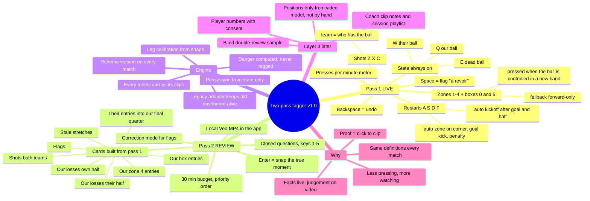

> **Superseded (2026-10-02)** by `docs/pipeline/PIPELINE.md` and `docs/pipeline/CODEBOOK.md`. Kept for history.

# Two-pass tagger (v1.0) – design

Date: 2026-09-30 · Status: designed by Claude on the user's delegation, after
council 4 ("stats psychosis"). Football definitions marked **[STAFF]** are
proposals until the staff confirms them (CLAUDE.md rule).

---

## 1. Why this exists (the coach's view)

The current tagger records *exceptions* ("something dangerous happened") and
asks the engine to guess the rest. The guesses are where the dissatisfaction
comes from:

- possession is inferred from silence (10–20 % of transitions are guessed);
- "dangerous" means "what the analyst noticed", so it changes with attention;
- tags lag the action by a variable amount, so clips start in the wrong place;
- the threat score is an opinion dressed as a number;
- every match adds a code, so no two matches are tagged the same way.

As a head coach I do not need more numbers. I need numbers I can **defend in
front of the players with the clip on the screen**. The test for every stat
in this system is one sentence:

> **If I cannot click from the number to the clips that make it up, it is not
> proof, and it does not go on the screen.**

The redesign follows from that test:

1. **Live, record only what is certain and continuous**: who has the ball,
   where it is (coarse), how it restarts, shots. These are facts, not
   judgements, and one person can keep up with them.
2. **After the match, answer closed questions on short clips** the live pass
   selected: why we lost it, how we got in, from which lane. This is where
   judgement happens, with the video, at your own speed, with the definition
   on screen.
3. **Let the computer do the counting**: danger, rates, tilt, transitions are
   computed from (1) + (2) with written rules, never tagged.

### Two passes, not necessarily two people

"Two taggers" means **two passes**. The same analyst can do both (live at the
field, then 20–30 min at home), or two people can split them. Splitting is
better when possible: the reviewer checks the live tagger's work as a side
effect, and the closed questions with on-screen definitions mean two people
answer the same way.

### What the coach gets that he does not get today

| Coach question (dressing room / staff meeting) | Today | v1.0 |
|---|---|---|
| "Did we actually dominate the ball?" | Guessed possession, gaps filled by inference | Every second of the match is US / THEM / DEAD, pressed live |
| "Did we play in their half?" | Tilt counts events (cards moved it) | Time with the ball in their final quarter vs theirs in ours |
| "Why do we keep giving it away?" | PERTE has no reason | Every loss has a cause (pass, duel, control, out, foul), checked on video |
| "How do we get into the box?" | Only when the tagger noticed | Every box entry, with lane and how (pass, through ball, carry, cross, second ball) |
| "Are we wasting time at restarts?" | Stoppage toggled by feel | Every dead ball timed, by restart type |
| "Show me." | Clip opens 8 s early and often misses | Clip opens at the moment, corrected on video; lag measured, not guessed |
| "Is this a trend or one bad game?" | Single-match numbers | Season ranges, rolling 3-match trend, schema version on every match |

---

## 2. Brain map



---

## 3. Pass 1 – live tagging

### 3.1 Keyboard (one hand on QWE/ASDF/ZXC, other on the number row)

| Key | Op | Meaning |
|---|---|---|
| `Q` | state US | We have the ball (a Lauréats player controls it) |
| `W` | state THEM | They have the ball |
| `E` | state DEAD | Ball out of play / whistle |
| `A` | restart THROW | Throw-in |
| `S` | restart CORNER | Corner |
| `D` | restart FK | Free kick |
| `F` | restart GK | Goal kick |
| `Shift+D` | restart PEN | Penalty |
| `Z` | shot OFF | Shot off target or blocked |
| `X` | shot ON | Shot on target, not a goal |
| `C` | shot GOAL | Goal |
| `0` | zone 0 | Ball in **our** box |
| `1`–`4` | zone 1–4 | Ball in band 1 (our end) … band 4 (their end) |
| `5` | zone 5 | Ball in **their** box |
| `Space` | flag | "À revoir" – I am not sure, look at this on video |
| `Backspace` | undo | Removes the last op |

Half start / half end are **buttons** (not keys) so they cannot be pressed by
accident. The half-2 clock starts at 45:00 as today.

**Why these keys.** Three rows, one per question: *who* (QWE), *how it
restarts* (ASDF), *did it end in a shot* (ZXC). The shot's team is whoever has
the ball – no team key needed. Zones live on the number row because they are
spatial (0 = our box … 5 = their box reads left to right like the pitch).

### 3.2 Rules (pinned in the codebook and tests)

- **State is always on.** Every second of a half belongs to exactly one state.
  From half start until the first `Q`/`W` the state is DEAD with restart
  KICKOFF.
- **Anchor for state keys [STAFF]:** press when a player *controls* the ball
  (not on a deflection, not when the pass is played). A 50/50 that bounces
  back and forth is not pressed until someone controls it.
- **Restart keys** are pressed during DEAD (as soon as the restart is known).
  The next `Q`/`W` says who takes it. A goal automatically inserts DEAD +
  KICKOFF; the conceding team kicks off.
- **Shots** belong to the state at the time of the shot; if DEAD (penalty,
  direct free kick), to the team that last had the ball **[STAFF]** – a flag
  fixes the rare exception.
- **Zones [STAFF]:** press when the ball is *controlled* in a new band (either
  direction), not while it travels. Auto-zones save presses: kickoff → 2 (us)
  or 3 (them); corner → 4 (us) / 1 (them); goal kick → 0 (us) / 5 (them);
  penalty → 5 (us) / 0 (them).
  **Fallback mode** (setting): forward-only zones – only presses that move
  the ball towards the attacked goal count.
- **Flag** never changes anything: it creates a review card.
- **Undo** removes the most recent op that is not already undone.

### 3.3 Live screen

Big colour banner for the state (gold US / blue THEM / grey DEAD), the zone
strip highlighted, the last 6 ops, clock, score, presses per minute (last 5
min and match), a red dot when the save failed. Nothing else: the analyst's
eyes belong on the pitch.

**Why the meter.** The council's biggest blind spot was the keystroke budget.
Target ≤ 12 presses/min; if the pilot shows more, switch to forward-only zones
before adding anything else. Every future key must replace an existing one.

### 3.4 Saving

Every op is written to IndexedDB the moment it is pressed. A snapshot of the
whole match is kept every 5 minutes (last 3 kept). Export reminders appear at
half time and at the end. A crash loses nothing.

---

## 4. Pass 2 – review on video

### 4.1 Video

The review screen plays the **downloaded Veo MP4** inside the app (file
picker, `URL.createObjectURL`, works offline). This is the key to precise
timing: answers are stamped with the real video time. Video position =
kickoff offset of the half + (live time − half start). Kickoff offsets are
entered once per half (as today).

Fallback when no file is available: each card opens Veo at `#t=` in another
tab; answers are still recorded but cannot be snapped. **Assumption to
verify first:** the club's Veo plan allows MP4 download.

### 4.2 Cards

The app builds a queue of cards from pass 1. Each card plays a clip
(8 s before → 4 s after the moment) and asks closed questions answered with
the number keys, definition shown on the card.

| Priority | Card | Built from | Questions [STAFF] |
|---|---|---|---|
| 1 | SHOT | every shot, both teams | lane (left/center/right); body (foot/head) |
| 2 | FLAG | every flag | correction mode (re-tag the 20 s window on video) |
| 3 | STALE | a live segment > 60 s with no op inside | "state correct throughout?" yes / fix / unknown |
| 4 | ENTRY_US_BOX | our zone change into 5 | lane; how: pass / through ball / carry / cross / second ball |
| 5 | LOSS_OWN | our possession ending (not by shot, goal, half end) in zones 0–2 | cause: pass / duel / control / out / foul |
| 6 | ENTRY_US_Z4 | our zone change into 4 from 0–3 | lane; how (same list, no cross) |
| 7 | LOSS_OPP | same as LOSS_OWN, zones 3–5 | cause |
| 8 | ENTRY_THEM | their zone change into 1 or 0 from 2–5 | lane |

Every card also has **Enter = "this is the moment"**: snaps the true time of
the anchor (control changed / ball crossed the band line). `←`/`→` ±1 s,
`,`/`.` ±0.2 s, `Space` play/pause, `N` next, `P` previous, `K` skip.

Cards (yellow/red) are added with a button at the current video time; they
never change state or tilt.

**Budget.** Each card ≈ 18 s (12 s clip + 6 s answer). Default budget 30 min
→ the queue shows the estimate and is cut by priority. Skipped cards stay
"non revu" – the engine reports them as unknown, never drops them silently.

**Why closed questions.** Free tagging on video is how the live tagger got
code creep. A fixed list with the definition on screen is how two people (or
the same person in October and in March) give the same answer.

### 4.3 Correction mode (flags and "fix")

Shows the pass-1 ops in the 20 s window; the reviewer re-presses the live keys
on the video. The new ops (stamped with video time) **replace** the pass-1
ops in that window. Stored separately (`pass2.corrections`) so the original is
never lost.

---

## 5. Data – export schema 1.0

One file per match; pass 2 adds to it. File name
`laureats_YYYY-MM-DD_<Opponent>_v1.json` (re-export after review gets a later
`exported_at`; the engine uses the latest export of a `match.id`).

```json
{
  "schema_version": "1.0",
  "tagger_version": "two-pass@1.0.0",
  "exported_at": "ISO-8601",
  "match": {"id": "m_…", "opponent": "…", "date": "YYYY-MM-DD", "venue": "home|away",
            "veoUrl": "…", "veoKickoffOffsetMs": 779000, "veoKickoffOffsetMs2": 4213000,
            "settings": {"zoneMode": "all|forward"}},
  "pass1": {"ops": [{"seq": 1, "t": 0, "half": 1, "k": "H", "v": "START"}]},
  "pass2": {"answers": [{"card": "LOSS_OWN:57", "op": 57, "a": {"cause": "PASS"},
                         "snap_t": 312400, "at": "ISO-8601"}],
            "corrections": [{"window": [300000, 320000], "half": 1, "ops": []}],
            "extras": [{"t": 1500000, "half": 2, "k": "CARD", "v": "YELLOW", "team": "them"}],
            "minutes_spent": 27}
}
```

Op kinds: `H` START|END · `S` US|THEM|DEAD · `R` THROW|CORNER|FK|GK|PEN|KICKOFF
· `Z` 0–5 · `SH` OFF|ON|GOAL · `F` null · `U` seq-to-undo. `t` = live clock ms.

**Single source of truth.** `shared/codebook.v1.json` holds keys, op values,
French labels, definitions, auto-zones, card kinds, questions, priorities and
thresholds. The tagger, the review screen, the Python engine and the tagging
manual read it. Changing a definition = editing data, not code.

**Two implementations, one truth.** The timeline derivation exists in JS (for
the screens) and Python (for analysis). Both are tested against the same
golden fixtures in `shared/fixtures/` so they cannot drift.

---

## 6. Engine changes

- `normalize_match(raw)` – the single entry point. Schema 1.x → derive
  timeline → possessions from state + legacy-shaped events (adapter), so
  every existing view keeps working. Schema 0.x → unchanged path.
- **Possession from state only.** A US→DEAD→US sequence is one possession
  (DEAD time = `stoppage_ms`), like today's "own set piece does not split".
  UNKNOWN time (marked in review) is excluded from every percentage and shown.
- **Proof metrics (`proof.py`)** – each returns `{value, n, clips}`:
  - possession % = US ÷ (US + THEM) live time; DEAD time by restart type
  - field tilt v1 **[STAFF]** = US time in zones 4–5 ÷ (US time in 4–5 + THEM
    time in 0–1); the classic event tilt stays beside it until the staff
    chooses
  - entries per team (zone 4, box), box entry ≤ 10 s after a regain,
    shots per box entry, share of our possessions that reach zone 4
  - losses by cause and zone (with "non revu")
  - entries by lane and type (from pass 2)
- **Lag calibration.** Every snapped answer gives lag = live t − true t.
  Median per op kind (S, Z, SH) × context (busy = ≥ 3 state ops within 15 s,
  else calm). Unsnapped ops are corrected by the median of their group when
  n ≥ 5, else by `DEFAULT_LAG_MS = 2000` **[STAFF/assumption]**. Clips open
  5 s before the corrected time.
- **Threat score**: removed from proof views. The classic dashboard keeps it
  until the staff retires it (legacy adapter maps pass-2 entry types to
  PASSE_PROF / CONDUITE / CENTRE so classic numbers still compute).
- **Comparability**: every match carries its schema version; season views
  never mix 0.x and 1.x in one average (they show two series).

---

## 7. Why a build, not one HTML file

The runtime stays a single offline HTML file – that part was right (no
install, works at the field, double-click). What was expensive was editing a
100 KB file with no tests: every change meant reading the whole file and
risking the live tool. v1.0 is **source in small modules, built into one
HTML file**:

- `tagger/` inside the football-analytics repo, same stack as the dashboard
  (Vite 5, React 18, Tailwind 3), `vite-plugin-singlefile` → `dist/index.html`.
- Pure logic (`src/core/*.js`) with `node --test`; screens are thin.
- Codes, keys, labels, definitions, card questions in
  `shared/codebook.v1.json`: most future changes are a JSON edit.
- Golden fixtures shared with Python.

A change now costs reading one 100-line module and its test, not the app.

---

## 8. Layer 3 (later, not in the v1 build)

1. **Coach layer** (recommended next): the coach stars clips, adds a one-line
   note, and builds the session playlist (list of Veo links) from the proof
   views. This is what turns analysis into a training session.
2. **Blind double review**: a second person answers 10 % of cards without
   seeing the first answers; agreement % per question. Below 80 % the
   definition is rewritten, not the person blamed.
3. **Player numbers** on losses and shots – opt-in, with player consent
   (Québec Law 25).
4. **Positions (x/y)**: not by hand. Tracking the ball with the cursor live
   needs both eyes on the screen and a hand that never drifts – it would cost
   the accuracy of everything else. If positions are ever needed, they come
   from the YOLO video experiment on the other computer, beside the
   pipeline.

---

## 9. Pilot and acceptance

1. Write three sentences: the story you think one already-tagged half tells.
2. Re-tag that half on Veo with pass 1 only. Read the presses/min meter.
3. Run pass 2 on it with the 30 min budget.
4. Compare possession %, tilt and losses with the old engine on the same half.

Freeze v1.0 if: ≤ 12 presses/min, no stretch the reviewer marks unknown
longer than 60 s, review fits in 30 min, and the numbers either confirm or
clearly contradict the three sentences. Otherwise switch to forward-only
zones and repeat. **No new codes this season.**

### Staff sign-off list
State anchor · zone anchor · auto-zones · loss causes · entry types · lanes
· field tilt v1 · STALE threshold 60 s · default lag 2 s · retiring the
threat score.
